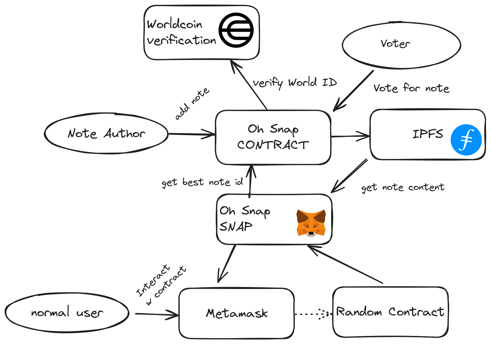

# 🏗 Chain Notes

<h4 align="center">
  <a href="https://github.com/chain-notes-brussels/chain-notes-snap">Repo</a> |
  <a href="https://chain-notes.vercel.app/">Website</a>
</h4>

🫰 Always falling for rugs and scams? Afraid to claim airdrops because you're unsure if the contract is safe? Chain Notes provides context about a contract, before a transaction. The context can show if a contract is malicious or safe, or provide other insightful information. What is shown is based on notes that are linked to an address, and voted on by the community. The voting logic is a slightly simplified version on Twitter/X's voting algorithm of Community Notes and we used [Vitalik's blog post](https://vitalik.eth.limo/general/2023/08/16/communitynotes.html) for guidance. We have set the contract up in such a way so that we can easily implement the full algorithm with some offchain computing when we continue after the hackathon.

⚙️ Built using NextJS, Foundry, Metamask Snap, World ID and Filecoin/IPFS.

- ✅ **User friendly UX**: Our Metamask Snap shows the most useful note/context before the user approves a transaction, to ensure the user does not interact with any malicious contracts.
- 🧱 **Sybil resistant**: Using Worldcoin WorldID ensures that every person can only vote once on a note.
- ⛓️ **Available on all chains**: Chain Notes is available on all EVM chains!

## Diagram

## Screenshots

| Landing page                      | Metamask Snap              |
| --------------------------------- | --------------------------------- |
|  |  |

|  Create Note                          | View note                      |
| --------------------------------- | --------------------------------- |
|  |  |

## Bounties

### Worldcoin

Our app uses zero-knowledge proofs using World ID for identity verification for both note authors as well as note voters. We think that this tool is needed in order expect an elevated level of quality of notes and votes, since it will be attatched to your identity. The protocol would not hold much value if it was spamable and World ID is the perfect tool to prevent this.

### Metamask Linea

This project was designed and built from the ground up with snaps in mind. We saw snaps being the perfect medium of communication these community notes in a easy way for users. We envisioned this project to be a helpful tool for people new to DeFi in order to mitigate the risk of interacting with, for example, phising Uniswap links. With this project being a snap, the information will be shown to the user right before the transaction is signed, and potentially saving new users their money.

We created a metamask snap ([in a seperate repo](https://github.com/chain-notes-brussels/snap)) and deployed to Linea testnet.

### Filecoin

Since these written notes are long string, it is not an option to store them on an evm chain. We didn't want to opt into centralized hosting for this either since we wanted to build a decantralized and tamperproof system. Because of this, we took inspiration from erc721's usage of IPFS and deployed our notes, along with some more data, as JSON to IPFS, and are only storing the ipfs URI on chain as a note identification on what to retrieve for the snap. We decided early on this would be the most logical way to do it, and are very happy with this design.

### Base

Our dApp is deployed on Base testnet. Our dApp provides community provided context to contracts before approving a transaction, which can be used to warn users about malicious contracts, as well as ensuring users they are communicating with the contract they expect. We think this is a great improvement to UX, since it's not intrusive and keeps users informed and safe. It was also the perfect chain to deploy to since it supports world ID, which makes it the perfect chain to showcase the fully featured app.

### Arbitrum

Deployed our project on Arbitrum testnet. We thought this fitted the DeSoc narrative mentioned in the bounty descriptions because we view this app as adding a social layer, of contract and wallet reputations, on top of the blockchain borrowing from social media concepts from x dot com.

### Morph

We deployed our contracts on Morph Holesky and manually added the config for the frontend, since this is not available yet in viem and scaffold. Bridging tokens to Morph and deploying was very straightforward. Only hickup we encountered was that we had to manually add network config on the frontend. 

- [Manual network config](https://github.com/chain-notes-brussels/chain-notes-snap/blob/d71b19303b4d260dab5b9d66f40d89af665c750b/packages/nextjs/utils/scaffold-eth/morechains.ts)

### Scroll

We deployed our contracts to scroll network.

### ApeCoin

We deployed our contracts to the ApeChain. Also we added custom config for the network on the frontend, since it was not available in viem and scaffold by default.
- [Manual network config](https://github.com/chain-notes-brussels/chain-notes-snap/blob/d71b19303b4d260dab5b9d66f40d89af665c750b/packages/nextjs/utils/scaffold-eth/morechains.ts)

### Zerion - Best build on ZERϴ Network

We deployed our contracts on Zerio testnet. Also we added custom config for the network on the frontend, since it was not available in viem and scaffold by default.
- [Manual network config](https://github.com/chain-notes-brussels/chain-notes-snap/blob/d71b19303b4d260dab5b9d66f40d89af665c750b/packages/nextjs/utils/scaffold-eth/morechains.ts)

### Zircuit - Best Project on Zircuit

We deployed our contracts on Zircuit and manually added the config for the frontend, since this is not available yet in viem and scaffold. Getting testnet tokens and deploying on Zircuit was very smooth. Only hickup we encountered was that we had to manually add network config on the frontend.

- [Zircuit manual network config](https://github.com/chain-notes-brussels/chain-notes-snap/blob/d71b19303b4d260dab5b9d66f40d89af665c750b/packages/nextjs/utils/scaffold-eth/morechains.ts)

## Links

- [Live dApp on Vercel](https://chain-notes.vercel.app/)
- [Github: Solidity contract and frontend dashboard](https://github.com/chain-notes-brussels/chain-notes-snap)
- [Github: Metamask Snap](https://github.com/chain-notes-brussels/snap)

### Deployed contracts
- [Notes.sol on Base Sepolia](https://sepolia.basescan.org/address/0x640a8be4be3B18b35A7D7bbBaB2444AD4d5fc87a)
- [Notes.sol on Arbitrum Sepolia](https://sepolia.arbiscan.io/address/0x3B89a9D1026E29c7959154E5c826159C720007cb)
- [Notes.sol on Scroll Sepolia](https://sepolia.scrollscan.com/address/0x15042Ce1Ff21659CE9CeB280618ca562526d5639)
- [Notes.sol on Linea Sepolia](https://sepolia.lineascan.build/address/0xC5972F3F7F43bD3692D9E5Ea0c2af96d56d0ee28)
- [Notes.sol on ApeChain](https://jenkins.explorer.caldera.xyz/address/0xa52A05eB2Eb48499d5bEB6d89d39dDB41854f47C)
- [Notes.sol on Zircuit](https://explorer.zircuit.com/address/0x77C461C1E180DD6A08A17E74bFb5207e44c7aC7f)
- [Notes.sol on Morph](https://explorer-holesky.morphl2.io/address/0x3B89a9D1026E29c7959154E5c826159C720007cb)
- [Notes.sol on Zero](https://explorer.zero.network/address/0x83277E9FE7Cc93Ad2D5986b87659A6fa80A48Ac0)

### References
- [Vitalik blog - What do I think about Community Notes?](https://vitalik.eth.limo/general/2023/08/16/communitynotes.html)

## Team

- [arjanjohan](https://x.com/arjanjohan/)
- [0xjsi.eth](https://twitter.com/0xjsieth)
- [Aleksandre Tsetskhladze](https://twitter.com/atsetsoffc)